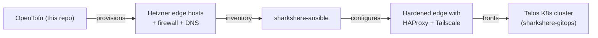

# jumpingsharks

OpenTofu infrastructure layer for the sharkshere homelab platform — provisions the public edge (two Hetzner Cloud servers, firewall rules, SSH key injection, DNS, and reverse DNS) that fronts a 4-node Talos Kubernetes cluster hosting GitLab CE, OpenProject, Vaultwarden, Jellyfin, and ~10 other public HTTPS services.

This is the foundation of a three-repo platform:

| Repo | Layer | Responsibility |
|---|---|---|
| `jumpingsharks` (this repo) | infrastructure | provisions Hetzner edge hosts + DNS/rDNS via OpenTofu |
| [`sharkshere-ansible`](https://github.com/Yornik/sharkshere-ansible) | hosts | hardens edge hosts, deploys HAProxy + Tailscale + fail2ban |
| [`sharkshere-gitops`](https://github.com/Yornik/sharkshere-gitops) | workloads | reconciles ~40 ArgoCD Applications behind that edge |

## Where this sits



## Scope

| Resource | Count | Notes |
|---|---|---|
| `hcloud_server` | 2 | Debian 13, `CX23`, dual-region (NBG1 + HEL1) |
| `hcloud_firewall.jump` | 1 | inbound rules attached to both jump hosts |
| Firewall rules | 5 inbound | `tcp/22`, `tcp/80`, `tcp/443`, `tcp/2222` (GitLab SSH), `udp/41641` (Tailscale WireGuard) |
| `hcloud_ssh_key` | 2 | injected at server creation |
| `hcloud_rdns` | 4 | IPv4 + IPv6 PTR per host → `jump.fedishark.eu` |
| `hcloud_zone_rrset` | 2 | A + AAAA round-robin for `jump.fedishark.eu` |

## Edge hosts

| Host | Location | Type | OS | Public DNS |
|------|----------|------|----|------------|
| `jump-eu-central` | Nuremberg (`nbg1`) | `CX23` | Debian 13 | `jump.fedishark.eu` |
| `jump-eu-north` | Helsinki (`hel1`) | `CX23` | Debian 13 | `jump.fedishark.eu` |

Both publish under the same `jump.fedishark.eu` name via round-robin A/AAAA, giving the cluster two geographically separate POPs with minimal complexity.

## Engineering highlights

- **IaC discipline maintained.** `tofu plan` returns clean on `main`; drift between the live state and code is treated as a defect, not an inconvenience. Verified end-to-end during the GitLab `:2222` rollout — HAProxy config on both jump hosts matched the Ansible template byte-for-byte, no out-of-band edits.
- **Single firewall, attached at boot.** Adding a new inbound port (e.g. `:2222` for GitLab SSH) is one rule block plus `tofu apply` — Hetzner attaches the firewall at server creation so newly-allowed traffic flows immediately.
- **Outputs as contract.** `outputs.tf` produces an `ansible_inventory` shape consumed directly by `sharkshere-ansible`, so infra and host config repos are coupled cleanly without manual inventory editing.
- **SOPS-encrypted secrets.** Hetzner API token lives in `secrets.enc.json`, decrypted at plan/apply time by the `carlpett/sops` provider.
- **PR-gated.** `tofu fmt -check`, `tofu validate`, `tflint`, and `tfsec` all run on every PR; merges to `main` are reviewed.

## Prerequisites

- [OpenTofu](https://opentofu.org/) >= 1.6
- [SOPS](https://github.com/getsops/sops) + age key for `secrets.enc.json`
- A Hetzner Cloud project with API access

## Usage

```sh
tofu init
tofu plan      # review every change before apply
tofu apply
```

## Important files

| File | Purpose |
|------|---------|
| `main.tf` | servers, firewall, SSH keys, DNS records, rDNS |
| `variables.tf` | `ssh_public_keys`, `jump_hosts` (per-host server_type + location), `dns_zone_name` |
| `terraform.tfvars` | public SSH keys (committed; the private keys live nowhere in this repo) |
| `secrets.enc.json` | SOPS-encrypted Hetzner API token |
| `outputs.tf` | `jump_hosts` (with IPs + PTR) and `ansible_inventory` for downstream consumption |
| `providers.tf` | provider configuration |
| `versions.tf` | provider/version pinning |
| `renovate.json5` | bumps provider pins + tooling versions |

## Outputs

- `jump_hosts` — per-host metadata including IPv4, IPv6, PTR, location
- `ansible_inventory` — pre-formatted inventory consumed by `sharkshere-ansible`

## CI

PR checks:

1. `tofu fmt -check`
2. `tofu validate`
3. `tflint`
4. `tfsec`

## State management

State is local (`terraform.tfstate` is gitignored, kept on the operator workstation). No remote backend — the homelab's blast radius doesn't justify the operational overhead of S3/etcd-backed state with locking. A backup of state lives alongside the SOPS-encrypted secrets.

## Homelab constraints

Even with dual edge hosts in two regions, the platform retains acknowledged single points of failure on the home side:

- Single home power feed
- Single home internet uplink
- Shared NAS storage dependency for part of the workload set

A UPS doesn't actually solve the power outage failure mode — when neighborhood power drops, the ISP's street-cabinet gear (DSLAM / GPON / DOCSIS amplifier) typically loses power within minutes, so the cluster stays up locally but with no upstream connectivity. Mitigation needs an independent secondary uplink (LTE/5G failover with its own battery). These are conscious tradeoffs. Fully eliminating them is feasible but currently disproportionate to the intended scope.
